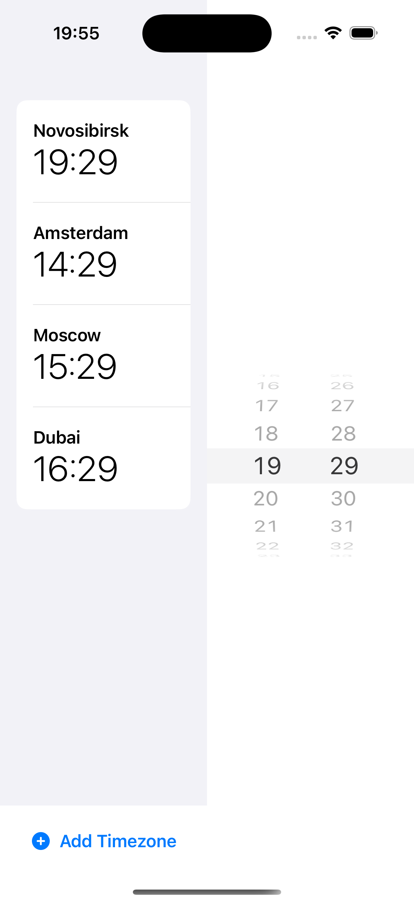
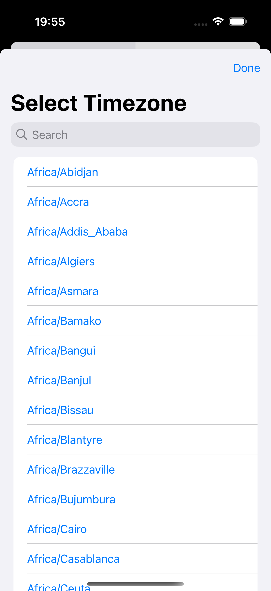
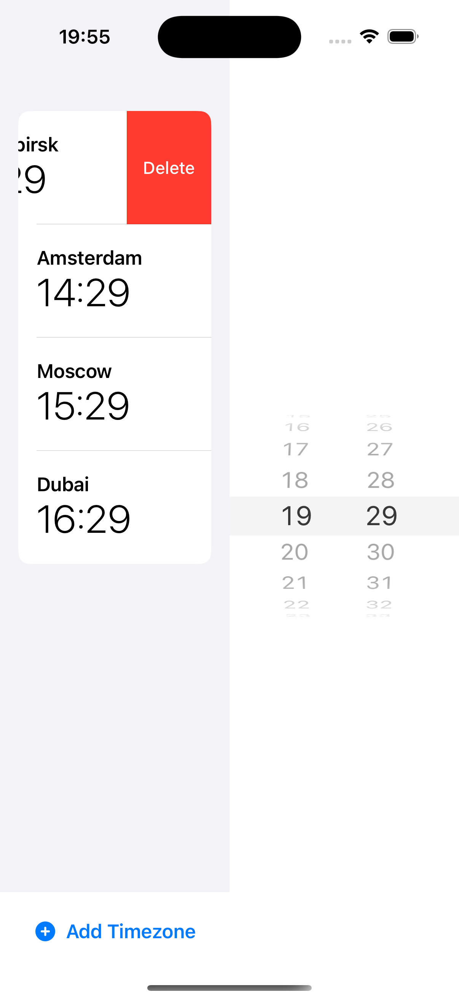

# TimeZoneView

TimeZoneView — это простое и элегантное SwiftUI приложение для iOS, которое позволяет пользователям отслеживать время в различных часовых поясах. Идеально подходит для тех, кто работает с международными командами или имеет друзей и семью в разных уголках мира.

## Функции

- Отображение текущего времени в нескольких часовых поясах одновременно
- Добавление новых часовых поясов из полного списка доступных
- Удаление ненужных часовых поясов
- Изменение времени для просмотра разницы во всех выбранных зонах
- Поиск по идентификаторам часовых поясов

## Архитектура

Приложение построено с использованием архитектуры на основе интентов (Intent-driven architecture), подобной MVI (Model-View-Intent):

- **Model**: Представлен структурой `TimeZoneState`
- **View**: Компоненты SwiftUI (`TimeZoneRootView`, `TimeZoneListView`, и т.д.)
- **Intent**: Действия пользователя определены в `TimeZoneIntent`
- **ViewModel**: `TimeZoneViewModel` обрабатывает интенты и обновляет состояние

## Структура проекта

- `TimeZoneViewApp.swift` - Точка входа в приложение
- `ContentView.swift` - Корневое представление приложения
- `TimeZoneViewModel.swift` - Логика обработки пользовательских действий
- `TimeZoneIntent.swift` - Определение всех возможных пользовательских действий
- `TimeZoneState.swift` - Структура состояния приложения
- `TimeZonePickerView.swift` - Представление для выбора новых часовых поясов
- `Components.swift` - Переиспользуемые компоненты интерфейса

## Требования

- iOS 15.0+
- Xcode 13.0+
- Swift 5.5+

## Установка

1. Клонируйте репозиторий:
```bash
git clone https://github.com/yourusername/TimeZoneView.git
```

2. Откройте файл `TimeZoneView.xcodeproj` в Xcode

3. Запустите проект на симуляторе или реальном устройстве

## Скриншоты





## Лицензия

Этот проект распространяется под лицензией MIT. Подробнее смотрите в файле [LICENSE](https://opensource.org/licenses/MIT).

## Автор

Дмитрий Архипов, 2025
